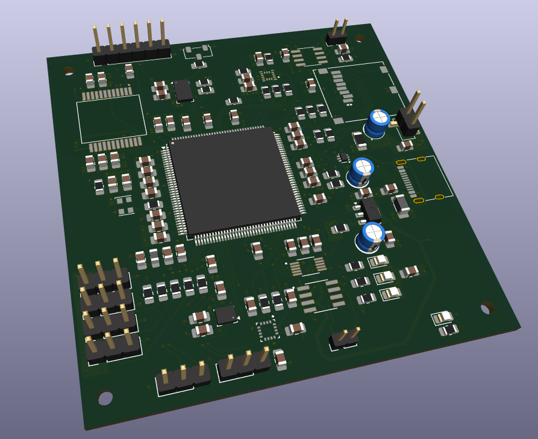
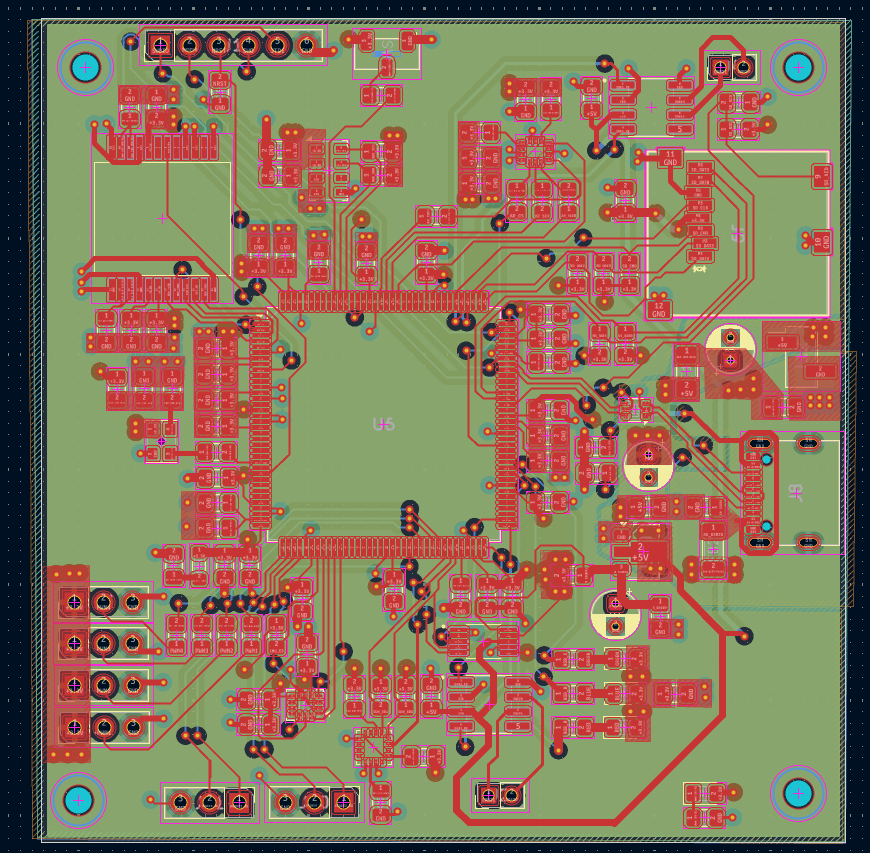
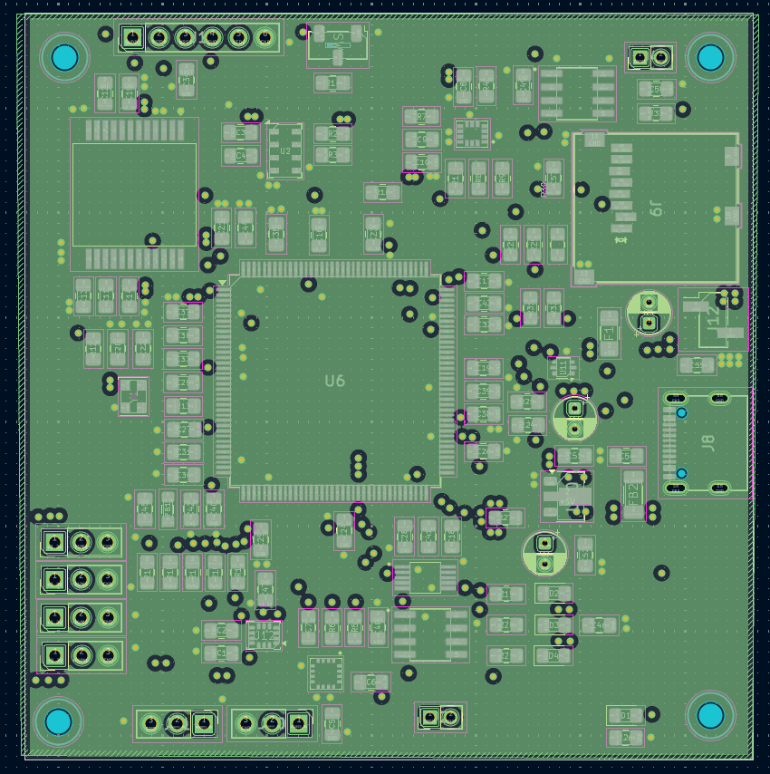
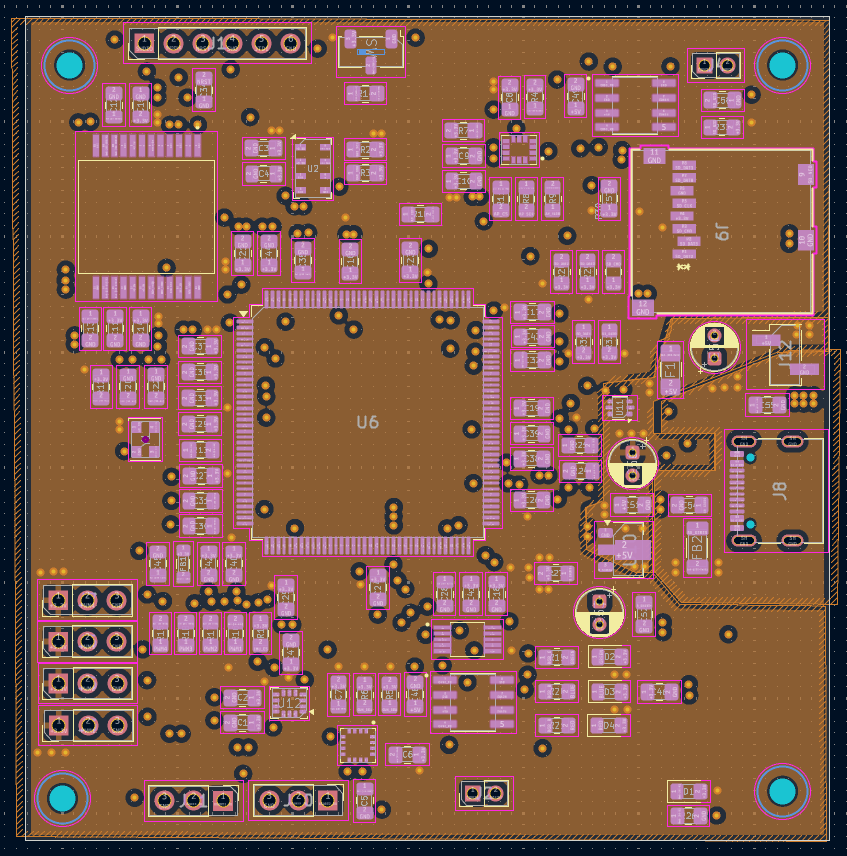
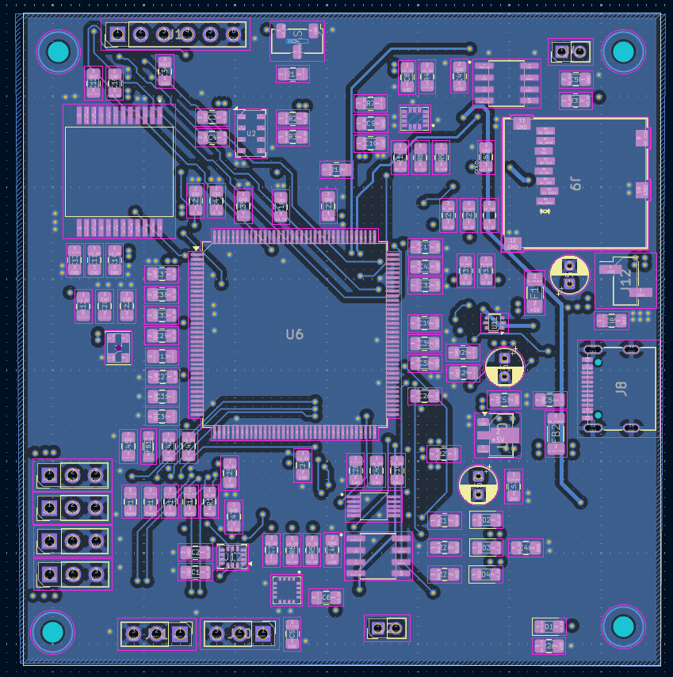

# 4-Layer Flight Controller

## Features

* **4-Layer PCB Architecture**
* **3× IMU** connected via SPI
* **1× Barometer**
* **1× Magnetometer**
* **2× UART Connectors**
* **4× PWM Connectors**
* **2× CAN Bus Connectors**
* **USB Type-C Connector**
* **MicroSD Card Interface**
* Dedicated power and ground planes for improved signal integrity and noise performance

## Hardware Architecture

The board is designed around a high-performance flight-control MCU and uses three independent SPI-connected IMUs for redundant motion sensing.

Additional onboard sensors provide:

* Sensitive inertial measurement by using the industrial standard IMUs , ICM-42686-P by TDK , ISM330ISNTR by STM , SCH16T-K01 by MURATA
* Current sensor for precise tracking of power consumed by the board
* Atmospheric pressure / altitude measurement
* Magnetic heading measurement
* Flight data logging through the SD card
* External communication through UART and CAN
* PWM outputs for servos, ESCs, and other actuators
* USB-C for communication, debugging, and firmware-related operations

## PCB Images
### Board stack-up is;
* Signal 
* Uninterrupted Ground
* Power 
* Signal
### PCB Overview

### Top Layer

### First Inner Layer

### Second Inner Layer 

### Bottom Layer

